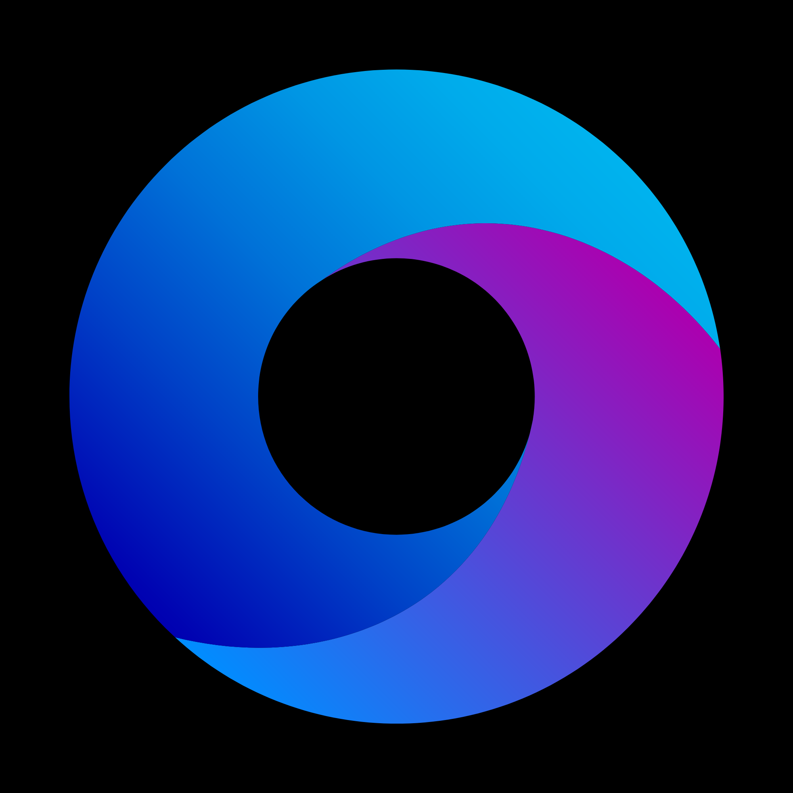
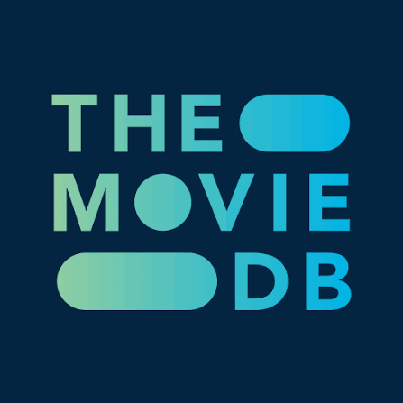

<div align="center">



# LolPlusTV

### Películas y series en un solo lugar

Aplicación multiplataforma desarrollada con **Flutter** para dispositivos móviles y **Android TV**, con catálogo basado en TMDB, múltiples fuentes, addons y reproductor integrado.

<br/>


</div>

---

## 📑 Contenido

* [Descripción](#-descripción)
* [Características](#-características)
* [Plataformas](#-plataformas)
* [Arquitectura](#-arquitectura)
* [Catálogos](#-catálogos)
* [Servidores](#-servidores)
* [Sistema de Addons](#-sistema-de-addons)
* [Interfaz](#-interfaz)
* [TMDB](#-tmdb)
* [Privacidad](#-privacidad)
* [Política de contenido](#-política-de-contenido)
* [Instalación](#-instalación)
* [Estructura del proyecto](#-estructura-del-proyecto)
* [Licencia](#-licencia)
* [Aviso legal](#-aviso-legal)

---

# 🎬 Descripción

**LolPlusTV** es una aplicación Flutter orientada al descubrimiento y reproducción de películas y series.

La aplicación combina diferentes servicios para proporcionar una experiencia centralizada:

```text
┌─────────────────────────────────────────────┐
│                  LolPlusTV                  │
├─────────────────────────────────────────────┤
│                                             │
│  TMDB                                       │
│  └── Metadatos                              │
│      ├── Películas                          │
│      ├── Series                             │
│      ├── Actores                            │
│      ├── Temporadas                         │
│      └── Recomendaciones                    │
│                                             │
│  Fuentes                                    │
│  └── Catálogos                              │
│      ├── Búsqueda                           │
│      ├── Listados                           │
│      └── Detalles                           │
│                                             │
│  Servidores                                 │
│  └── Enlaces de reproducción                │
│      ├── Idiomas                            │
│      ├── Calidad                            │
│      └── Subtítulos                         │
│                                             │
│  Player                                     │
│  └── Reproducción                           │
│                                             │
└─────────────────────────────────────────────┘
```

La aplicación funciona como **cliente/agregador de interfaces y servicios externos**.

> El contenido multimedia no se aloja ni se distribuye directamente desde los servidores de LolPlusTV.

---

# ✨ Características

| Característica             | Descripción                                               |
| -------------------------- | --------------------------------------------------------- |
| 🏠 **Inicio**              | Películas y series organizadas en diferentes secciones    |
| 🔎 **Búsqueda**            | Búsqueda mediante TMDB y fuentes externas                 |
| 🧭 **Descubrir**           | Exploración de catálogos disponibles                      |
| 🎬 **Detalles**            | Información, reparto, temporadas y episodios              |
| 🌐 **Servidores**          | Diferentes servidores de reproducción                     |
| ▶️ **Reproductor**         | Reproducción integrada                                    |
| 💬 **Subtítulos**          | Soporte para subtítulos cuando están disponibles          |
| ❤️ **Favoritos**           | Guardado local de contenido                               |
| 🕐 **Historial**           | Registro y progreso de reproducción                       |
| 📺 **Android TV**          | Interfaz optimizada para mando y navegación por foco      |
| 📱 **Mobile**              | Interfaz adaptada a teléfonos                             |
| ⬇️ **Descargas**           | Gestión de contenido descargado/local                     |
| ⚙️ **Ajustes**             | Configuración general de la aplicación                    |
| 🧩 **Addons**              | Sistema extensible de fuentes y catálogos                 |
| 🎨 **Temas**               | Posibilidad de seleccionar diferentes estilos de interfaz |
| 🔌 **APIs personalizadas** | Integración de APIs externas configuradas por el usuario  |

---

# 📱 Plataformas

Actualmente el proyecto está diseñado para:

### Android Mobile

Interfaz adaptada a:

* teléfonos
* diferentes tamaños de pantalla
* navegación táctil
* orientación vertical/horizontal

### Android TV

Interfaz adaptada a:

* televisores
* Android TV
* Google TV
* control remoto
* navegación mediante foco
* navegación mediante D-Pad

La aplicación mantiene una arquitectura compartida, pero utiliza diferentes **Shells de presentación**:

```text
                    LolPlusTV
                       │
             ┌─────────┴─────────┐
             │                   │
          Mobile                TV
             │                   │
      Mobile Shell          TV Shell
             │                   │
             └─────────┬─────────┘
                       │
                    Features
                       │
              ┌────────┴────────┐
              │                 │
           Domain             Data
```

---

# 🧩 Sistema de Addons

LolPlusTV está diseñado para trabajar con un sistema extensible de **addons**.

Existen dos tipos principales:

### 1. Fuentes

Las fuentes proporcionan acceso a:

* catálogos
* búsquedas
* detalles
* episodios
* servidores
* información adicional

### 2. Catálogos

Los catálogos permiten añadir nuevas listas o secciones de contenido.

La relación conceptual es:

```text
                    ADDONS
                       │
             ┌─────────┴─────────┐
             │                   │
          FUENTES             CATÁLOGOS
             │                   │
             │                   │
             └───────┬───────────┘
                     │
              Contenido
                     │
             Películas / Series
```

Cuando el usuario quiere agregar un catálogo, primero debe:

```text
Seleccionar una fuente existente
              │
              ▼
       Seleccionar catálogo
```

o:

```text
Crear / agregar una nueva fuente
              │
              ▼
       Seleccionar catálogo
```

Esto permite que el sistema mantenga una relación clara entre **fuente → catálogo → contenido**.

---

# 🎨 Interfaz y temas

LolPlusTV está preparado para permitir que el usuario seleccione el estilo visual de la aplicación.

Conceptualmente:

```text
Ajustes
   │
   └── Apariencia
          │
          ├── Tema
          │
          ├── Estilo de interfaz
          │
          ├── Colores
          │
          ├── Tamaño de tarjetas
          │
          └── Navegación
```

Los estilos pueden modificar elementos como:

* tarjetas
* navegación
* colores
* bordes
* radios
* tamaños
* distribución
* densidad de información
* comportamiento de la interfaz

El objetivo es separar:

```text
Lógica de negocio
        ≠
Diseño visual
```

de forma que sea posible cambiar la apariencia sin reescribir las funcionalidades principales.

---

# 🌐 Catálogos actuales

Fuentes utilizadas para listados y búsquedas:

| ID          | Nombre    | Listado | Búsqueda |
| ----------- | --------- | :-----: | :------: |
| `serieskao` | SeriesKao |    ✅    |     ✅    |
| `tioplus`   | TioPlus   |    ✅    |     ✅    |
| `cuevana`   | Cuevana   |    ✅    |     ✅    |
| `pelisplus` | PelisPlus |    ✅    |     ✅    |
| `cinehax`   | CineHax   |    ✅    |     —    |

### Metadata principal

Los metadatos principales de películas y series se obtienen mediante **TMDB**.

Esto permite mantener separada la información descriptiva del contenido respecto de las fuentes externas.

---

# ▶️ Servidores de reproducción

Extractores/proveedores actualmente registrados:

| ID            | Nombre      | Identificador |
| ------------- | ----------- | ------------- |
| `embed69`     | Embed69     | `EMBED69`     |
| `poseidon`    | Poseidon    | `POSEIDON`    |
| `cuevana`     | Cuevana     | `CUEVANA`     |
| `unlimplay`   | Unlimplay   | `UNLIM`       |
| `cinesrc`     | CineSRC     | `CINESRC`     |
| `cinecalidad` | Cinecalidad | `CINE`        |
| `tioplus`     | TioPlus     | `TIOPLUS`     |
| `fuegocine`   | FuegoCine   | `FUEGO`       |
| `hackstore`   | HackStore   | `HACK`        |
| `pelisplus`   | PelisPlusHD | `PELIS+`      |
| `pelispedia`  | Pelispedia  | `PEDIA`       |
| `seriesmetro` | SeriesMetro | `METRO`       |
| `smartpelis`  | SmartPelis  | `SMART`       |
| `customapi`   | Mis APIs    | `API`         |

Los proveedores pueden activarse o desactivarse desde:

```text
Ajustes
   └── Fuentes
        └── Servidores
```

---

# 🏗️ Arquitectura

La aplicación utiliza una arquitectura dividida en capas.

```text
┌──────────────────────────────────────┐
│             PRESENTATION             │
│        Mobile / TV / Shared         │
└──────────────────┬───────────────────┘
                   │
                   ▼
┌──────────────────────────────────────┐
│              FEATURES               │
│ Home · Search · Content · Player    │
│ Settings · Addons · Favorites       │
└──────────────────┬───────────────────┘
                   │
                   ▼
┌──────────────────────────────────────┐
│               DOMAIN                │
│ Models · Repositories · Services    │
└──────────────────┬───────────────────┘
                   │
                   ▼
┌──────────────────────────────────────┐
│                DATA                  │
│ TMDB · Sources · Scrapers · APIs    │
│ Extractors · Aggregators            │
└──────────────────┬───────────────────┘
                   │
                   ▼
┌──────────────────────────────────────┐
│                CORE                  │
│ Network · Storage · Errors · Utils  │
└──────────────────────────────────────┘
```

### Flujo principal

```text
Usuario
   │
   ▼
Presentation
   │
   ▼
Feature
   │
   ▼
Domain
   │
   ▼
Repository
   │
   ▼
Data
   │
   ├── TMDB
   ├── Sources
   ├── Scrapers
   ├── APIs
   └── Extractors
```

---

# 📁 Estructura del proyecto

La estructura principal de `lib/` está organizada de la siguiente manera:

```text
lib/
│
├── main.dart
│
├── app/
│   ├── app.dart
│   ├── app_config.dart
│   ├── app_theme.dart
│   ├── app_constants.dart
│   ├── app_router.dart
│   └── app_lifecycle.dart
│
├── core/
│   ├── errors/
│   ├── network/
│   ├── storage/
│   ├── utils/
│   ├── constants/
│   └── result/
│
├── domain/
│   ├── models/
│   │   ├── content/
│   │   ├── source/
│   │   ├── server/
│   │   ├── player/
│   │   ├── user/
│   │   └── addon/
│   │
│   ├── repositories/
│   └── services/
│
├── data/
│   ├── datasources/
│   │   └── remote/
│   │       ├── tmdb/
│   │       └── sources/
│   │
│   ├── scrapers/
│   │   ├── base/
│   │   ├── home/
│   │   ├── detail/
│   │   └── servers/
│   │
│   ├── extractors/
│   │   ├── hls/
│   │   └── providers/
│   │
│   ├── aggregators/
│   └── repositories/
│
├── features/
│   ├── home/
│   ├── search/
│   ├── discover/
│   ├── content/
│   ├── servers/
│   ├── player/
│   ├── downloads/
│   ├── favorites/
│   ├── history/
│   ├── profile/
│   ├── settings/
│   └── addons/
│
├── presentation/
│   ├── mobile/
│   ├── tv/
│   └── shared/
│
└── generated/
```

> La documentación detallada de cada carpeta y archivo puede mantenerse en `docs/ARCHITECTURE.md`.

---

# 🔄 Flujo de reproducción

El flujo general de reproducción es:

```text
Contenido
   │
   ▼
TMDB
   │
   ▼
Detalle
   │
   ▼
Fuente
   │
   ▼
Servidor / Extractor
   │
   ▼
Enlace de reproducción
   │
   ▼
Player
   │
   ├── Calidad
   ├── Idioma
   ├── Subtítulos
   └── Progreso
```

---

# 🎞️ TMDB

LolPlusTV utiliza **The Movie Database (TMDB)** para obtener información de películas y series.

Se utiliza para datos como:

* títulos
* títulos originales
* pósteres
* backdrops
* sinopsis
* géneros
* reparto
* temporadas
* episodios
* recomendaciones
* identificadores TMDB

<p align="center">
  <a href="https://www.themoviedb.org/">
    
  </a>
</p>

> This product uses the TMDB API but is not endorsed or certified by TMDB.

**API:** https://www.themoviedb.org/

Las imágenes son servidas mediante la infraestructura de imágenes de TMDB.

---

# 🔐 Privacidad

LolPlusTV no requiere una cuenta propia para utilizar las funciones principales de la aplicación.

Las preferencias pueden almacenarse localmente en el dispositivo.

Entre los datos almacenados localmente pueden encontrarse:

* fuentes activas
* favoritos
* historial
* progreso
* preferencias de reproducción
* apariencia
* configuración de la aplicación

La aplicación puede realizar solicitudes hacia:

```text
TMDB
  │
  ├── Metadatos
  └── Imágenes

Fuentes externas
  │
  ├── Catálogos
  ├── Búsquedas
  └── Información

Servicios de reproducción
  │
  └── Enlaces / servidores

API de actualización
  │
  └── Versiones
```

No se venden datos personales.

Si en el futuro se incorporan servicios de analítica, cuentas o infraestructura en la nube, deberán documentarse en esta sección.

---

# ⚖️ Política de contenido

**LolPlusTV no aloja, sube ni distribuye directamente archivos multimedia.**

La aplicación funciona como cliente para servicios externos y puede mostrar:

* metadatos
* imágenes
* información de contenido
* enlaces proporcionados por fuentes externas

Las fuentes externas son independientes del proyecto.

LolPlusTV no controla:

* disponibilidad
* contenido
* políticas
* funcionamiento
* legalidad de servicios externos

El usuario debe utilizar la aplicación de acuerdo con las leyes aplicables en su jurisdicción.

Si eres titular de derechos y consideras que una integración infringe tus derechos, puedes contactar al administrador del servicio correspondiente o solicitar una revisión de la integración.

---

# 🚀 Instalación

### Requisitos

* Flutter 3.x
* Dart compatible con la versión de Flutter
* Android SDK
* Android Mobile o Android TV
* conexión a Internet

### Clonar el proyecto

```bash
git clone <REPOSITORY_URL>
cd lolplustv
```

### Instalar dependencias

```bash
flutter pub get
```

### Ejecutar

```bash
flutter run
```

### Comprobar el entorno

```bash
flutter doctor
```

---

# 🧪 Desarrollo

Para analizar el proyecto:

```bash
flutter analyze
```

Para ejecutar las pruebas:

```bash
flutter test
```

Para comprobar los dispositivos disponibles:

```bash
flutter devices
```

---

# 📦 Build

### APK

```bash
flutter build apk --release
```

### App Bundle

```bash
flutter build appbundle --release
```

### Android TV

El proyecto puede generar builds destinados a dispositivos Android TV utilizando la configuración correspondiente del proyecto Android.

---

---

# 📄 Licencia

Actualmente el proyecto utiliza una licencia de uso personal.

```text
Uso personal. Todos los derechos del código de la aplicación
reservados por el autor, salvo las librerías de terceros que
conservan sus propias licencias.

El contenido multimedia, marcas, servicios y datos proporcionados
por terceros pertenecen a sus respectivos titulares.

La aplicación no reclama propiedad sobre dichos contenidos.
```

Si el proyecto se publica posteriormente como código abierto, esta sección puede sustituirse por una licencia específica como MIT, GPL u otra compatible con las dependencias utilizadas.

---

# ⚠️ Aviso legal

Al utilizar LolPlusTV:

1. El usuario es responsable del uso que haga de la aplicación.
2. Los servicios externos son independientes del proyecto.
3. Las fuentes externas pueden cambiar o dejar de funcionar.
4. El proyecto no garantiza la disponibilidad de servicios externos.
5. El usuario debe respetar las leyes aplicables en su jurisdicción.

---

<div align="center">

### 🎬 LolPlusTV

**Flutter · Mobile · Android TV**

Hecho con Flutter ❤️

</div>
